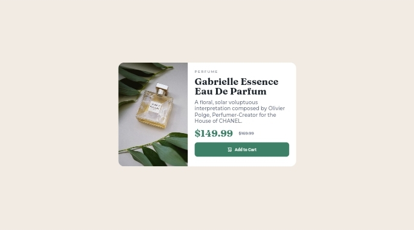

# Frontend Mentor - Product preview card component solution

This is a solution to the [Product preview card component challenge on Frontend Mentor](https://www.frontendmentor.io/challenges/product-preview-card-component-GO7UmttRfa). Frontend Mentor challenges help you improve your coding skills by building realistic projects. 

## Table of contents

- [Overview](#overview)
  - [The challenge](#the-challenge)
  - [Screenshot](#screenshot)
  - [Links](#links)
- [My process](#my-process)
  - [Built with](#built-with)
  - [What I learned](#what-i-learned)
  - [Continued development](#continued-development)
  - [Useful resources](#useful-resources)
- [Author](#author)
- [Acknowledgments](#acknowledgments)

**Note: Delete this note and update the table of contents based on what sections you keep.**

## Overview

### The challenge

Users should be able to:

- View the optimal layout depending on their device's screen size
- See hover and focus states for interactive elements

### Screenshot

### Links

- Solution URL: [Add solution URL here](https://your-solution-url.com)
- Live Site URL: [Add live site URL here](https://your-live-site-url.com)

## My process

### Built with

- Semantic HTML5 markup
- CSS custom properties
- Flexbox
- Mobile-first workflow

### What I learned

Aprendi sobre picture, classe "sr-only", @media e adquiri mais conhecimento sobre posicionar elementos.

### Continued development

### Useful resources

- [w3schools](https://www.w3schools.com/default.asp) - Tirou minhas dúvidas sobre algumas tags html e propriedades css.

## Author

- Frontend Mentor - [@JohnNasci](https://www.frontendmentor.io/profile/JohnNasci)

## Acknowledgments

[@vcarames](https://www.frontendmentor.io/profile/vcarames)
Me deu dicas valiosas que me ajudou a melhorar meu projeto.
